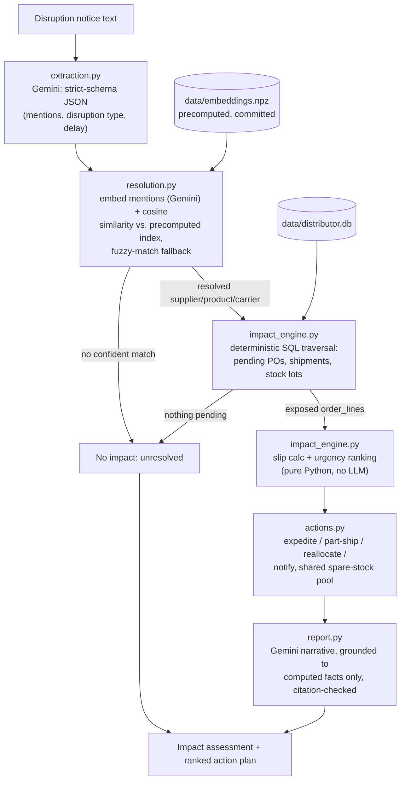

TRACK_ID=PS06

# Disruption Response Assistant

A response assistant for a distributor (buys from suppliers, holds warehouse stock,
fulfils customer orders). It takes a disruption notice as it actually arrives -
a supplier email about a production halt, a carrier delay notice, a warehouse
incident report - unstructured text that names things loosely, and:

1. Works out what the notice means and maps it to suppliers, shipments, or stock
   in the system's own data.
2. Traces what it actually affects - which stock runs short, which orders slip,
   which customers are hit, and by when.
3. Produces an impact assessment and a ranked action plan: affected orders ranked
   by urgency, options for each with trade-offs stated plainly (expedite at higher
   cost, part-ship, reallocate stock, or inform the customer of a new date), and a
   recommended course of action.

Every impact claim is traceable to the underlying data. A notice that sounds
alarming but maps to nothing pending comes back as exactly that - no impact.
The system recommends; a human operator decides and acts.

## Status

Core pipeline complete and working end-to-end: extraction, entity resolution,
deterministic impact tracing, action/trade-off generation, and a grounded
report, wired to a single-page UI. See commit history for build order.

## How it works (architecture)



Only two things ever touch Gemini: **extraction** (raw notice → structured
fields) and the **narrative** (computed facts → prose, checked afterward for
citations it wasn't given). Everything in between - resolution thresholds,
SQL traversal, slip/urgency math, option generation - is deterministic
Python, which is what makes every number in the final report traceable back
to a specific record ID.

- **Deterministic core, LLM at the edges.** All impact reasoning - what stock is
  affected, which orders slip, by how many days, urgency ranking, trade-off costs -
  is plain Python running relational queries over the seeded dataset. The only
  reasoning ever handed to Gemini is (a) pulling structured candidate entities out
  of the free-text notice, and (b) writing the final narrative around facts that
  were already computed. This matters because the system is evaluated on
  `gemini-3.5-flash-lite`, a small model that cannot be trusted to do the
  reasoning itself.
- **Grounding / retrieval.** Every supplier, shipment, stock lot, and order row in
  the dataset is embedded once (`gemini-embedding-001`) and stored locally. The
  same index is used both to resolve loose mentions in a notice ("the Chennai
  gasket supplier") to actual records, and to ground the final report's citations
  in specific row IDs.
- **No impact is a first-class outcome.** If nothing in the notice resolves to
  data that is actually pending (open PO, in-transit shipment, allocated stock),
  the system stops there and reports no impact rather than inventing one.
- **Resilient to a slow/unavailable model.** Every Gemini call has a bounded
  timeout and limited retries so one bad call can't blow the request budget.
  The narrative-writing call is treated as a non-essential nice-to-have: if it
  fails, the report still returns with a deterministic fact-only summary
  instead of failing the whole request.

## Data

Synthetic, hand-crafted (not randomly generated) dataset covering the full
chain: 6 suppliers, 10 products, 10 purchase orders, 5 shipments, 5 on-hand
stock lots, 8 customers, and 15 customer orders with their order lines. Built
by `data/seed_data.py`, committed as `data/distributor.db`. See
`data/schema.sql` for the relational shape.

The dataset is deliberately constructed so some orders drawing on the *same*
supplier or product are exposed by a disruption and some are not - e.g. two
orders depend on Coastal Gasket Works' incoming shipment, while a third order
for the same product is already covered by on-hand stock from an older,
already-received purchase order, and is correctly excluded from that
supplier's impact.

Sample notices for manual testing (production halt, carrier delay, warehouse
incident, and two deliberate no-impact cases) are in `data/sample_notices.json`
and selectable from the UI's dropdown.

## Running it

```bash
pip install -r requirements.txt
python app.py
```

Then open `http://localhost:8000`.

Requires a `GEMINI_API_KEY` in a `.env` file (see `.env.example`). No other
external services are called. Entity embeddings are precomputed and committed
(`data/embeddings.npz`, built by `data/build_index.py`) so nothing is
indexed at startup.

## Tests

```bash
python -m pytest tests/ -v
```

Covers the deterministic impact engine (exposure tracing, slip calculation,
the no-double-counting fix for shared spare stock) against the seeded
dataset. No API calls, runs in well under a second.

## Demo video

(link to be added)
